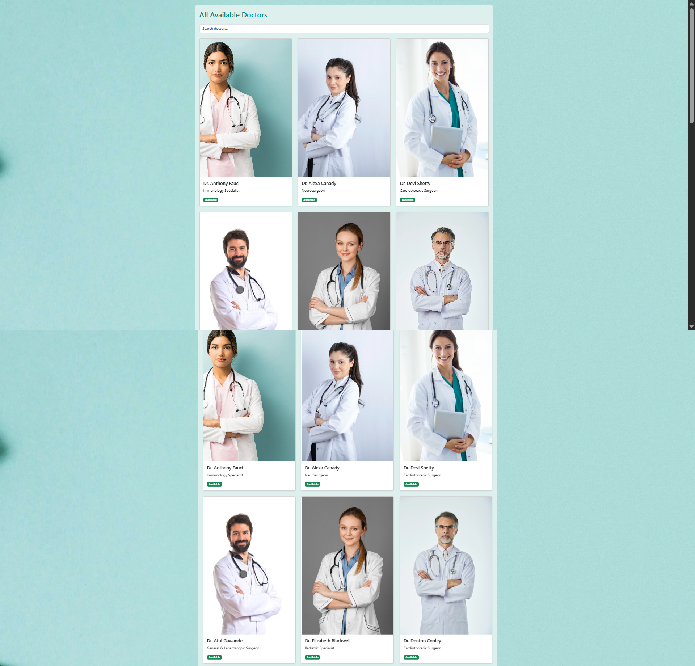
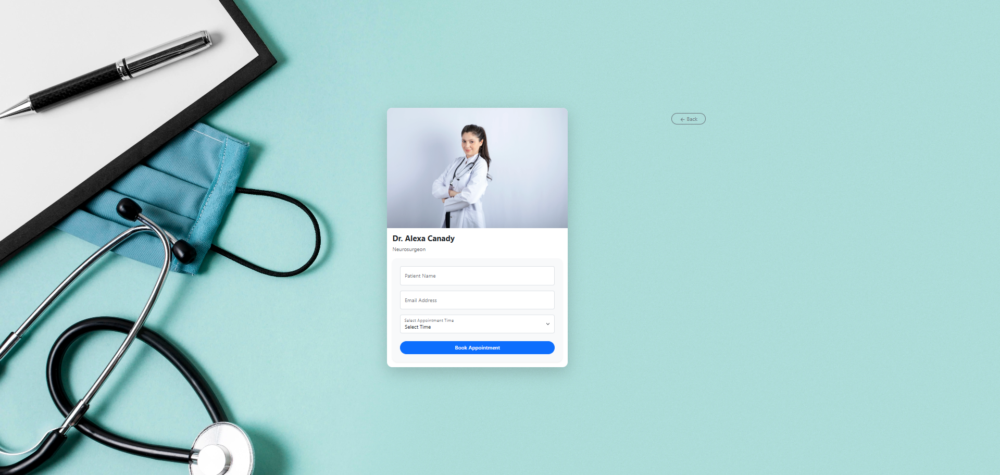

# All Doctors Page

Develop a Doctors List page, ensuring it is user-friendly and visually appealing.

## Web Interface

## Doctor Details Page

## Mobile Interface

---

## Project Summary

- The `data.json` returns the Doctors list.
- The cards are animated and scrollable.
- If a user clicks on a particular doctor's profile, it will navigate to the Doctor Profile Page where the user can book appointments.
- Implement maintainable and reusable coding standards.
- The tabs must not be hardcoded; their length should adjust dynamically based on `data.json`.
